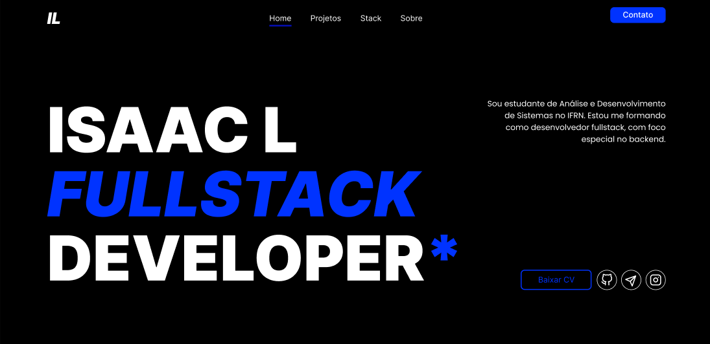

# Isaac Lira | Portfólio 🚀

Portfólio pessoal desenvolvido com Angular para apresentar meus projetos, tecnologias e evolução como desenvolvedor.



## 🎨 Design

O layout foi criado no Figma:

### 🔗 **[Acessar Protótipo no Figma](https://www.figma.com/design/oSFlNOrWsAejhZDu2RyxYi/Portifolio?node-id=1-3&p=f&t=6KJMvgcpm9ZHKPbn-0)**

## 🛠️ Tecnologias

- Angular
- TypeScript
- HTML
- Typescript

## 📂 Estrutura

```
src/
├── app/
│   ├── components/
│   ├── models/
│   └── app.routes.ts
│
└── styles.css
```

O projeto utiliza componentes separados para cada seção:

- Hero
- Sobre
- Projetos
- Stack
- Contato
- Footer

## 🚀 Rodando o projeto

Clone o repositório:

```bash
git clone https://github.com/IsaacLira42/isaac-portfolio-angular.git
```

Instale as dependências:

```bash
npm install
```

Execute:

```bash
ng serve
```

Acesse:

```
http://localhost:4200
```

## 👨‍💻 Sobre

Estudante de Análise e Desenvolvimento de Sistemas e desenvolvedor em formação com foco em desenvolvimento Full Stack.

## 📄 Currículo

Disponível em:

📄 [Baixar meu currículo em PDF](https://github.com/IsaacLira42/isaac-portfolio-angular/blob/main/public/Isaac_Lira-desenvolvedor_fullStack.pdf)
